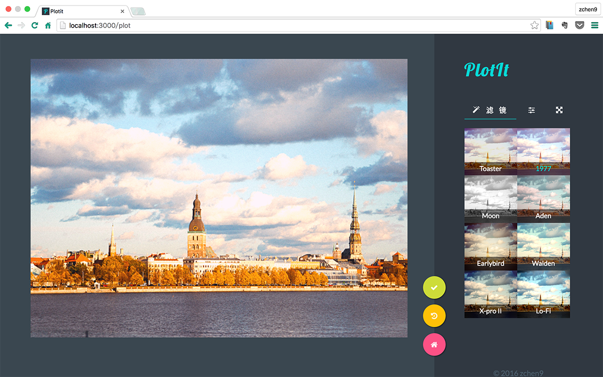
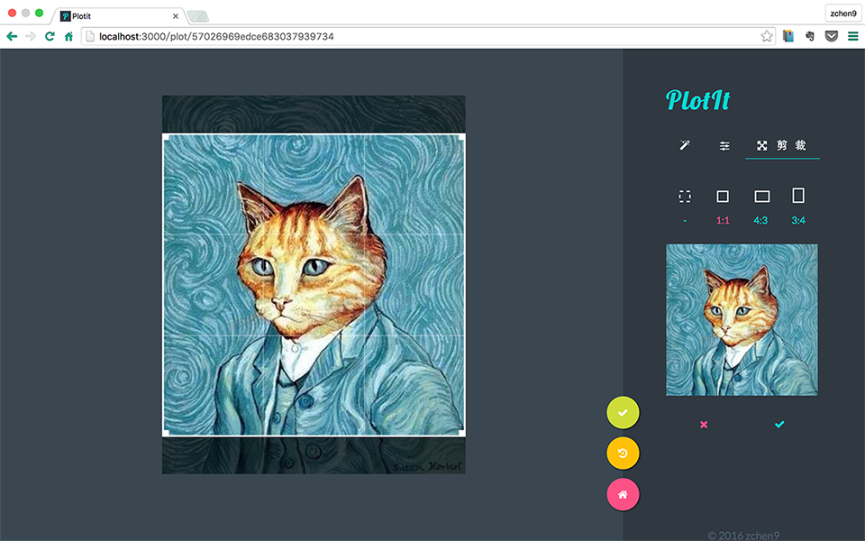

# PlotIt

Online tool for processing picture

## Dev

Based on HTML5 Canvas & MEAN (MongoDB / Express / Angular / NodeJS) & Karma

### Features

- Upload the local images to Plotit, then these images will be uploaded to Qiniu 

- Download the image you've already uploaded to Plotit

- Support eight filters (Moon / Toaster / 1977 / Aden / Earlybird / Walden / X-pro II / Lo-Fi)

- Support six basic adjusters (Brightness / Saturation / Contrast / Sepia / Noise / Blur)

- One step for reset the image

- Rename the image

- Share picture to Weibo

### Upcoming Features

- Clip
- Resize
- Rotate
- Share picture to Wechat (maybe...)
- fix some filters & adjusters

## Screenshot

#### HOME PAGE

#### FILTER PAGE

#### ADJSUTER PAGE

#### RESIZE PAGE

 
## Thanks for the inspiration

- [[ CammaJS ]](https://github.com/meltingice/CamanJS)
- [[ CSSgram ]](https://github.com/una/CSSgram)

## LICENSE

